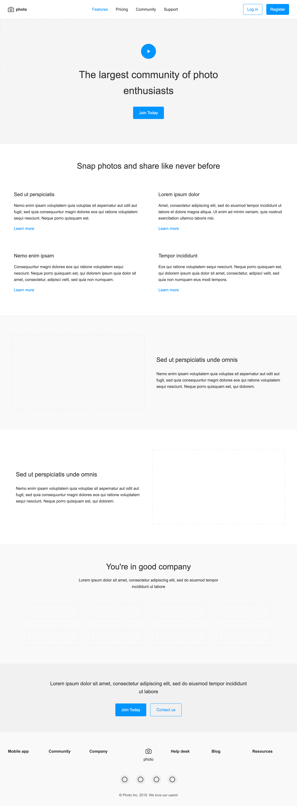
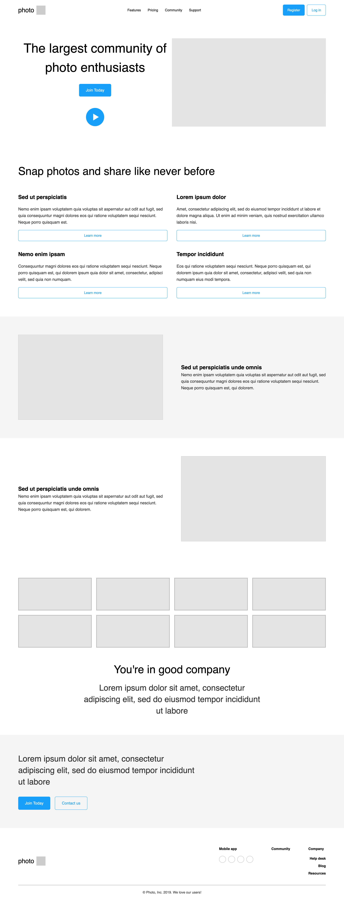

# Website AI assistant 

## webcrumbs - frontend-ai

- [webcrumbs - frontend-ai](https://app.webcrumbs.ai/frontend-ai)
  - support GUI to modify directly
  - support RWD
  

- results
  - [ ] Header
  - [x] Hero
  - [x] Features Section
  - [ ] content-with-image
  - [x] community
  - [x] CTA Section
  - [ ] Footer
  - [x] social-links

## Cursor - agent mode - claude-3.7-sonnet

1. by uploading image

- [x] Header
- [x] Hero
- [x] Features Section
- [x] content-with-image
- [x] community
- [ ] CTA Section
- [x] Footer
- [ ] social-links
  

2. by Figma MCP

- [x] Header
- [ ] Hero
- [x] Features Section
- [x] content-with-image
- [x] community
- [ ] CTA Section
- [x] Footer
- [ ] social-links
